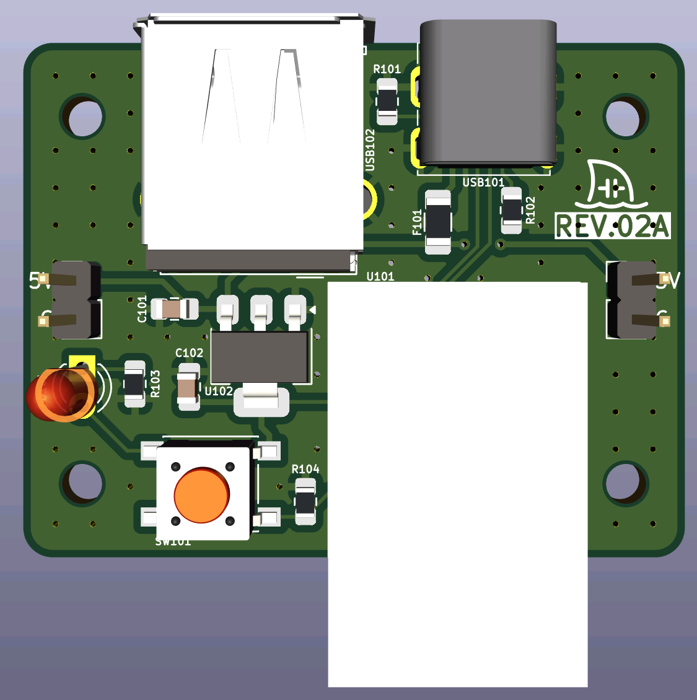
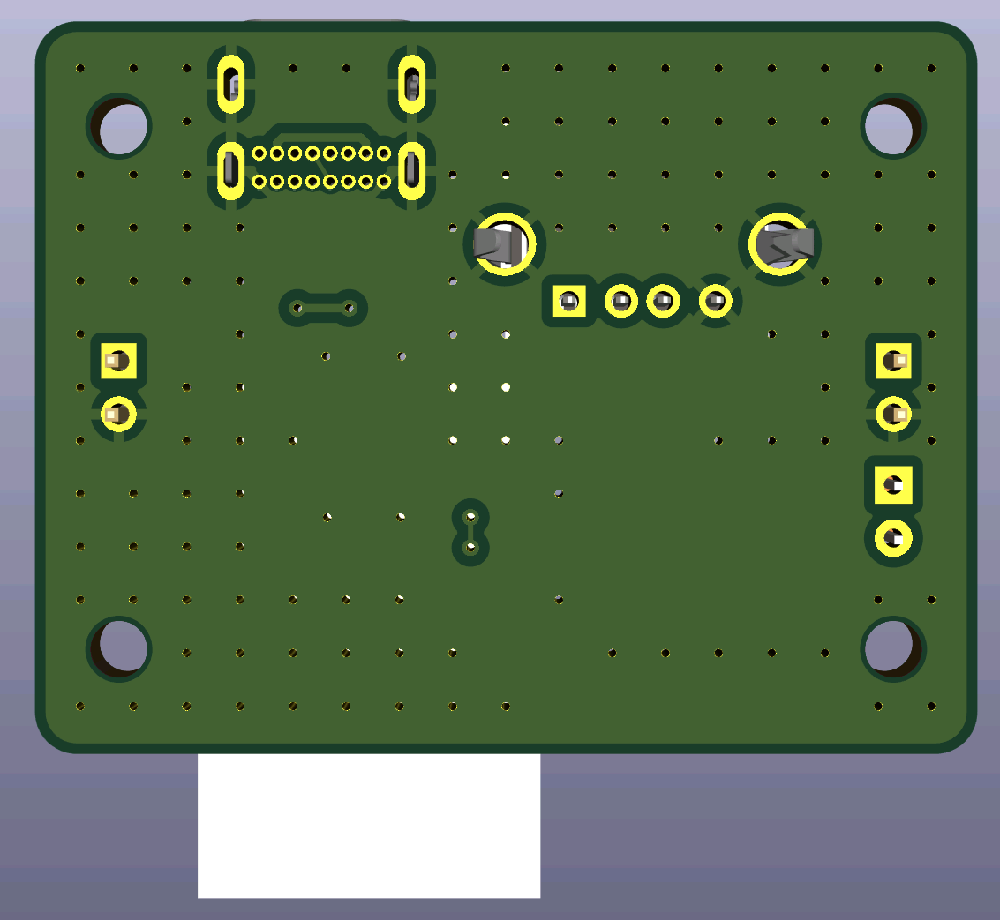

# Wiimote-USB-Adapter
This is a Wiimote adapter to wirelessly connect remotes for Dolphin or other emulators through a USB-C connection to a computer.

Includes support for sensor bar USB passthrough (power only) or external infrared LEDs to act as a standalone sensor bar.

## Features
- USB-C power/data input
- USB-A port for external sensor bars

## Concept
I wanted a way to connect Wiimotes to a computer without the overhead of third-party Bluetooth adapters.  This uses the OEM Wiimote Bluetooth module, so there is minimal latency and no weird syncing issues.

## Planned Features
- Enclosure with support for integrated IR LEDs to act as a standalone sensor bar

## PCB Renders
|PCB Front|PCB Back|
|---------|--------|
|||
